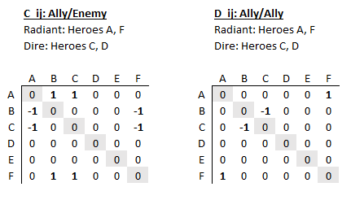

---
jupyter:
  jupytext:
    formats: ipynb,md
    text_representation:
      extension: .md
      format_name: markdown
      format_version: '1.2'
      jupytext_version: 1.6.0
  kernelspec:
    display_name: Python 3
    language: python
    name: python3
---

## Win Analysis: Machine Learning on Hero Selection

Use match data and several machine learning models to try and classify the winner based on hero selection 
as well as hero/enemy hero pair interactions (i.e. enemy team counters/weaknesses).

```python
import sys
import copy
import pandas as pd
import numpy as np
from sklearn.linear_model import LogisticRegression
from sklearn.ensemble import RandomForestClassifier, GradientBoostingClassifier
from sklearn.metrics import *
from sklearn.svm import LinearSVC, SVC
from sklearn import linear_model
from sklearn.model_selection import GridSearchCV
from sklearn.dummy import DummyClassifier
sys.path.append("..")
from dotautil import MLEncoding
```

## "First order" modeling

Encode match data for classifiers to determine probability of a radiant win. It's tempting to write a linear logistic regression model like this:

`log(p/(1-p)) = c0 + x1*c1 + x2*c2 + x3*c3 + ... `

where `c0` is the intercept and represents the contribution from being on radiant, `x1` .. `xn` are indicator variables, 
where `1` indicates the hero was selected on radiant, and `-1` indicates the hero was selected on dire. The issue here 
is that the interpretation of the coefficients becomes difficult. This assumes that each hero has symmetric effects, radiant vs. dire, which is not in general true. e.g. If `c1` is high, does that mean a high win rate for radiant or a high loss rate for dire?

Instead we will break each match into two vectors `x` and `y` (radiant and dire) and use only `{0,1}` indicator variables. For logistic classificaiton:

`log(p/(1-p)) = x1*a1 + x2*a2 + x3*a3 + ... + y1*b1 + b2*c2 + b3*c3 + ...`

where `x_n=1` denotes hero was present on radiant, and `y_n=-1` denotes the hero was present on dire. The negation is used so  that a positive coefficient on a dire term means the hero was more likely a win (i.e. the sign conventions are consistent radiant vs. dire when we interpret coefficients).

We will call this matrix `x1_hero`, which has shape `(num_matches, 2*num_heroes)`, which encodes first order/single hero features.

## "Second order" modeling

Here we expand the descriptor to include ally/enemy interactions and ally/ally inteactions ("2nd order"). The benefit of doing this explicitly (vs. using something like a neural network) is the that coefficients of hero pairings will be interpretable using simple logistic regression. Inherently non-linear models (e.g. random forests, neural networks) don't need these features explicitly.

For each match, we define two interaction matrices `C_ij` (ally/enemy) and `D_ij` (ally/ally), where `i` and `j` are indcies over a hero:



For ally/enemy interactions we assume the interactions are anti-symmetric (`A_ij = -A_ji`) and for ally-ally interactions we assume they are symmetric (`D_ij = D_ji`). We use this fact to make the matrices upper triangular and reduce the number of features required. Prior to regression we'll unravel or flatten this upper triangular matrix into a vector.

```python
y_radiant_win = np.load("output/ydata_3_20000101.npy")
x1_hero = np.load("output/x1_data_3_20000101.npy")
x2_ally_enemy = np.load("output/x2_data_3_20000101.npy")
x3_all = np.load("output/x3_data_3_20000101.npy")

print("Large matrix size: {}".format(x3_all.shape))
```

# Preliminary Model Search

We'll try several models using first order descriptors only, a dummy model (which should just predict a radiant win), a random forest model (which has a tendancy to overfit, so consider this an upper bound on how much information is encoded in hero selection), a first order logistic regression, and a GradientBoostingClassifier.

```python
models={
    "Dummy" : 
        (DummyClassifier(strategy="constant"),
         { 'constant' : [0,1] }  ),
    "RandomForest" :
        (           
          RandomForestClassifier(n_estimators=100,
                                 bootstrap=False), # Turn off external CV
         { 'max_depth' : [1,2,3,4,5,10] }
        ),
    "Logistic_Regression" :
        (
            LogisticRegression(fit_intercept=False),
            { 'C' : [1, 0.1, 0.01, 0.001] }
        ),
    "GradientBoostingClassifier" :
        (
            GradientBoostingClassifier(verbose=2),
            {                
                "max_depth" : [1,2,3,4,5],
            }
        ),    
}
```

```python
models_search={}
for model_name, model in models.items():
    print("............................................................")
    print(model_name)
    gscv=GridSearchCV(estimator=model[0], 
                      param_grid=model[1],
                      verbose=2,
                      cv=3,
                      n_jobs=4,
                      scoring=make_scorer(accuracy_score))
    models_search[model_name]=copy.copy(gscv.fit(x1_hero, y_radiant_win))
        
print("Done")
```

```python
for model_name, model_search in models_search.items():
    print("\n=========================================================")
    print(model_name)
    for params,mean_test_score in zip(model_search.cv_results_['params'], model_search.cv_results_['mean_test_score']):    
        print("\t"+str(params))
        print("\t"+str(mean_test_score))
        
    y_bar=model_search.best_estimator_.predict(x1_hero)

    print(".............................")
    print("accuracy score")
    print(str(accuracy_score(y_radiant_win, y_bar)))

    print("balanced accuracy score")
    print(str(balanced_accuracy_score(y_radiant_win, y_bar)))

    print("confusion matrix")
    print(str(confusion_matrix(y_radiant_win, y_bar)))
```
## Logistic Regression; Including 2nd Order Effects

Note that L1 penality is used as in general this will force more coefficients to zero (i.e. sparse coefficient matrix). Intercept/constant column is added, which effectively captures the radiant advantage. A number signficiant less than one (0.01) is chosen so that very little penality is applied (i.e. intercept is weighy more heavily thanm hero pairs).

```python
intercept = 0.01*np.ones([x3_all.shape[0], 1])
x3_intercept = np.concatenate([intercept, x3_all], axis=1)
```

```python
lr=LogisticRegression(
    fit_intercept=False,
    class_weight='balanced',
    tol=1e-3,
    penalty='l1',
    warm_start=True,
    solver='saga')

params={ 'C' : [10, 1, 0.1] }
gscv=GridSearchCV(estimator=lr, 
                  param_grid=params,                  
                  verbose=2,
                  cv=3,
                  n_jobs=1,
                  scoring=make_scorer(accuracy_score))

gscv.fit(x3_intercept, y_radiant_win)
```

```python
for params, mean_test_score in zip(gscv.cv_results_['params'], gscv.cv_results_['mean_test_score']):    
    print("\t"+str(params))
    print("\t"+str(mean_test_score))

y_bar = gscv.best_estimator_.predict(X3)
print(str(accuracy_score(y,y_bar)))
print(str(balanced_accuracy_score(y,y_bar)))
print(str(confusion_matrix(y,y_bar)))
```

```python
# First get the radiant and dire coefficients... in general these should be similar
coef=gscv.best_estimator_.coef_
a=(coef[0,0:meta.NUM_HEROES]).reshape(meta.NUM_HEROES,1)
b=(coef[0,meta.NUM_HEROES:2*meta.NUM_HEROES]).reshape(meta.NUM_HEROES,1)
```

```python
# Next unpack the 2nd order matrix...
c_flat=coef[0,2*meta.NUM_HEROES:]
c=ml_encoding.unflatten_second_order_upper(c_flat)
```

```python
results=pd.DataFrame(np.hstack([a,b,c]))
```

```python
results.index=meta.HERO_DICT.values()
results.columns=['dire','radiant']+list(meta.HERO_DICT.values())
```

```python
results
```

```python

```
